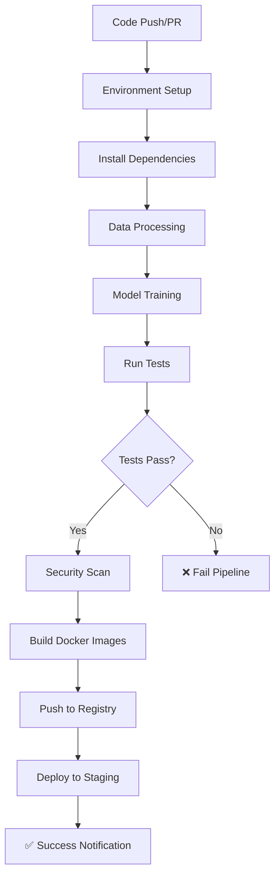

# 🖌️ Dig-Reg: Handwritten Digits Classification


[](https://github.com/munikumar229/Dig-Reg/actions/workflows/main.yaml)
[](https://github.com/munikumar229/Dig-Reg/actions/workflows/pr-validation.yaml)

---

## **Overview**

**Dig-Reg** is a full-stack machine learning project for **handwritten digits classification**.  
It allows users to **draw digits (0–9) in the browser** and predict them in real-time using trained **Random Forest** and **MLP Neural Network** models.  

Key technologies include:

- **Streamlit** for interactive frontend
- **FastAPI** for backend API
- **MLflow** for experiment tracking and model registry
- **Docker** for containerized deployment
- **GitHub Actions** for CI/CD automation

---

## **Features**

- 🎨 Draw digits on a canvas in the web interface
- 🤖 **Multiple ML Models**: Choose between RandomForest and MLP (Neural Network) models
- 🔮 Real-time prediction with model comparison capabilities
- 📊 MLflow experiment tracking: metrics, parameters, artifacts, and model registry
- 📈 Interactive prediction probabilities and performance metrics
- 🔌 API endpoint to integrate with other applications
- 🐳 Dockerized deployment for easy scaling and portability
- � Automated CI/CD pipeline for preprocessing, training, Docker build, and deployment

---

## **Project Structure**

```
Dig-Reg/
│
├── data/processed/                   # Preprocessed train/val/test CSVs
├── backend/                         # FastAPI backend service
│   ├── main.py                     # Backend entry point
│   └── app/
│       ├── main.py                 # FastAPI application factory
│       ├── api/
│       │   ├── endpoints.py        # API route handlers
│       │   └── schemas.py          # Request/response models
│       └── models/
│           └── loader.py           # Model loading with fallbacks
├── frontend/                        # Streamlit frontend UI
│   ├── app.py                      # Main Streamlit application
│   └── components/
│       └── api_client.py           # API communication layer
├── scripts/                         # Training & data processing
│   ├── train.py                    # Model training & MLflow logging
│   ├── process_data.py             # Dataset preprocessing
│   ├── test_models.py              # Model validation
│   └── train_all_models.sh         # Batch training script
├── deployment/                      # Docker configuration
│   ├── docker-compose.yml          # Multi-container orchestration
│   ├── Dockerfile.backend          # Backend container config
│   └── Dockerfile.frontend         # Frontend container config
├── models/                          # Trained model artifacts
├── mlruns/                          # MLflow experiment tracking data
├── tests/                           # Test suites
├── docs/                            # Comprehensive documentation
├── config/                          # Configuration files
├── requirements.txt                 # Python dependencies
└── .github/workflows/               # CI/CD workflows
```

## **Installation**

### Prerequisites
- Python 3.12+
- Docker (optional, for containerized deployment)

### Setup

1. **Clone the repository:**
```bash
git clone https://github.com/munikumar229/Dig-Reg.git
cd Dig-Reg
```

2. **Create and activate virtual environment:**
```bash
python3 -m venv myenv
source myenv/bin/activate  # On Windows: myenv\Scripts\activate
```

3. **Install dependencies:**
```bash
pip install --upgrade pip
pip install -r requirements.txt
```

---

## **Usage**

### **Running Locally**

1. **Preprocess the data:**
```bash
python scripts/process_data.py
```

2. **Train models and log to MLflow:**
```bash
# Train RandomForest model
python scripts/train.py --model randomforest

# Train MLP (Neural Network) model
python scripts/train.py --model mlp

# Or train both models at once
bash scripts/train_all_models.sh
```

3. **Run FastAPI backend:**
```bash
uvicorn backend.main:app --host 0.0.0.0 --port 8000
```

4. **Run Streamlit frontend (in another terminal):**
```bash
streamlit run frontend/app.py --server.port 8501
```

5. **Open your browser at:** `http://localhost:8501`

## **Docker Deployment**

> **📦 Note**: This application uses **2 Docker images** that work together:
> - `munikumar229/dig-reg-backend:latest` (FastAPI + ML models)
> - `munikumar229/dig-reg-frontend:latest` (Streamlit UI)

### **Option A: One-Click Deployment (Easiest)**

```bash
# Download and run deployment script
curl -sSL https://raw.githubusercontent.com/munikumar229/Dig-Reg/main/deployment/deploy.sh | bash
```

### **Option B: Manual Deployment with Pre-built Images**

```bash
# Download production compose file
curl -o docker-compose.yml https://raw.githubusercontent.com/munikumar229/Dig-Reg/main/deployment/docker-compose.production.yml

# Pull both images and start
docker-compose pull
docker-compose up -d

# Access the applications
# Frontend: http://localhost:8501
# Backend API: http://localhost:8000
# API Documentation: http://localhost:8000/docs
```

### **Option C: Build Locally**

```bash
# Navigate to deployment directory
cd deployment

# Build and start all services
sudo docker-compose up --build -d

# Stop services
sudo docker-compose down
```

### **Manual Docker Build**

```bash
# Build backend image
docker build -f deployment/Dockerfile.backend -t dig-reg-backend .

# Build frontend image
docker build -f deployment/Dockerfile.frontend -t dig-reg-frontend .

# Run containers
docker run -p 8000:8000 dig-reg-backend
docker run -p 8501:8501 dig-reg-frontend
```

---

## **CI/CD Pipeline**

### **🚀 Automated Workflows**

The project includes comprehensive CI/CD automation with **two main workflows**:

#### **1. Main CI/CD Pipeline** (`.github/workflows/main.yaml`)
**Triggers:** Push to main/master branch
- ✅ **Environment Setup**: Python 3.12, dependency caching
- 📊 **Data Processing**: Automated dataset preprocessing
- 🤖 **Model Training**: Both RandomForest and MLP models
- 🧪 **Testing**: Model validation and API tests
- 🐳 **Docker Build**: Multi-container images (backend + frontend)
- 🔒 **Security Scanning**: Trivy vulnerability analysis
- 🚀 **Deployment**: Staging environment deployment
- 📢 **Notifications**: Build status reporting

#### **2. Pull Request Validation** (`.github/workflows/pr-validation.yaml`)
**Triggers:** Pull request creation/updates
- 🔍 **Code Quality**: Flake8 linting and Black formatting
- 🧪 **Testing**: Data processing and model training tests
- 📁 **Structure Validation**: Project organization checks
- 🐳 **Docker Testing**: Container build verification (no push)
- ⚙️ **Configuration**: Docker-compose validation

### **🏗️ Pipeline Stages**



### **🔧 Pipeline Features**

- **🏃 Fast Builds**: Dependency caching for faster execution
- **🐳 Multi-Container**: Separate backend and frontend images
- **🔒 Security First**: Vulnerability scanning with Trivy
- **📊 Quality Gates**: Automated testing and validation
- **🌍 Environment Management**: Staging deployment pipeline
- **📢 Status Reporting**: Real-time build notifications

### **🚀 Deployment Strategy**

1. **Development**: Local testing with hot-reload
2. **Pull Request**: Validation without deployment
3. **Main Branch**: Full pipeline with staging deployment
4. **Production**: Manual promotion from staging (when ready)

**Pipeline Status:** All workflows are active and monitored

---

## **MLflow Tracking**

Track experiments, metrics, parameters, and models:

```bash
mlflow ui
```

Visit `http://127.0.0.1:5000` to view:
- 📈 Experiment dashboard
- 🗂️ Model registry
- 📁 Artifacts and metrics

---

## **Technologies & Dependencies**

- **Python 3.12** - Core programming language
- **Streamlit** - Interactive web application framework
- **FastAPI** - Modern, fast web framework for building APIs
- **scikit-learn** - Machine learning library
- **Pandas** - Data manipulation and analysis
- **NumPy** - Numerical computing
- **OpenCV** - Computer vision library
- **MLflow** - ML lifecycle management
- **Docker** - Containerization platform
- **streamlit-drawable-canvas** - Canvas component for Streamlit

---

## **API Documentation**

Once the FastAPI backend is running, visit:
- **Interactive API docs:** `http://localhost:8000/docs`
- **Alternative docs:** `http://localhost:8000/redoc`

### Example API Usage:

```python
import requests
import numpy as np

# Prepare your 8x8 digit image as a flattened array (64 values)
image_data = np.random.rand(64).tolist()  # Replace with actual image data

response = requests.post(
    "http://localhost:8000/predict",
    json={
        "pixels": image_data,
        "model_type": "randomforest"  # or "mlp"
    }
)

prediction = response.json()
print(f"Predicted digit: {prediction['predicted_digit']}")
print(f"Confidence: {prediction['confidence']:.2f}")
```

---

## **Architecture**

```
┌─────────────────┐   HTTP/REST   ┌──────────────────┐   MLflow   ┌─────────────────┐
│   Streamlit     │ ────────────► │    FastAPI       │ ─────────► │   ML Models     │
│   Frontend      │               │    Backend       │            │   & Registry    │
│   (Port 8501)   │ ◄──────────── │   (Port 8000)    │ ◄───────── │                 │
└─────────────────┘               └──────────────────┘            └─────────────────┘
        │                                 │                               │
        │                                 │                               │
        ▼                                 ▼                               ▼
┌─────────────────┐               ┌──────────────────┐            ┌─────────────────┐
│   Canvas API    │               │  Model Loader    │            │  Pickle Files   │
│   Drawing UI    │               │  Health Checks   │            │  Fallback Models│
│   Predictions   │               │  Error Handling  │            │                 │
└─────────────────┘               └──────────────────┘            └─────────────────┘
```

---

## **Development**

### **Running Tests**

```bash
# Test backend API (requires running backend)
python tests/test_backend_api.py

# Test models
python tests/test_models.py

# Run all tests
python -m pytest tests/
```

### **Training New Models**

```bash
# Process data
python scripts/process_data.py

# Train specific model
python scripts/train.py --model randomforest
python scripts/train.py --model mlp

# Train all models
bash scripts/train_all_models.sh
```

### **Project Organization**

- **Backend**: Modern FastAPI with automatic OpenAPI documentation
- **Frontend**: Streamlit with component-based architecture  
- **Scripts**: Separate training and utility scripts
- **Tests**: Comprehensive API and model testing
- **Deployment**: Multi-container Docker setup

---

## **Documentation**

📚 **Complete Guides Available:**
- [📋 Integration Guide](docs/INTEGRATION_GUIDE.md) - Complete setup and integration details
- [🔧 Technical Architecture](docs/TECHNICAL_ARCHITECTURE_REPORT.md) - System architecture documentation  
- [🚀 Quick Start](README_QUICKSTART.md) - Get running in 30 seconds
- [📊 API Documentation](http://localhost:8000/docs) - Interactive API docs (when running)

## **Contributing**

1. Fork the repository
2. Create a feature branch (`git checkout -b feature/amazing-feature`)
3. Commit your changes (`git commit -m 'Add some amazing feature'`)
4. Push to the branch (`git push origin feature/amazing-feature`)
5. Open a Pull Request

---

## **License**

This project is licensed under the MIT License. See the [LICENSE](LICENSE) file for details.

---

## **Contact**

**Author:** Muni Kumar and Abhiroop

**GitHub:** [@munikumar229](https://github.com/munikumar229) and [@shadowscythe03](https://github.com/shadowscythe03)

**Project Link:** [https://github.com/munikumar229/Dig-Reg](https://github.com/munikumar229/Dig-Reg)

---

**Made with ❤️ for the Machine Learning Community** 🚀